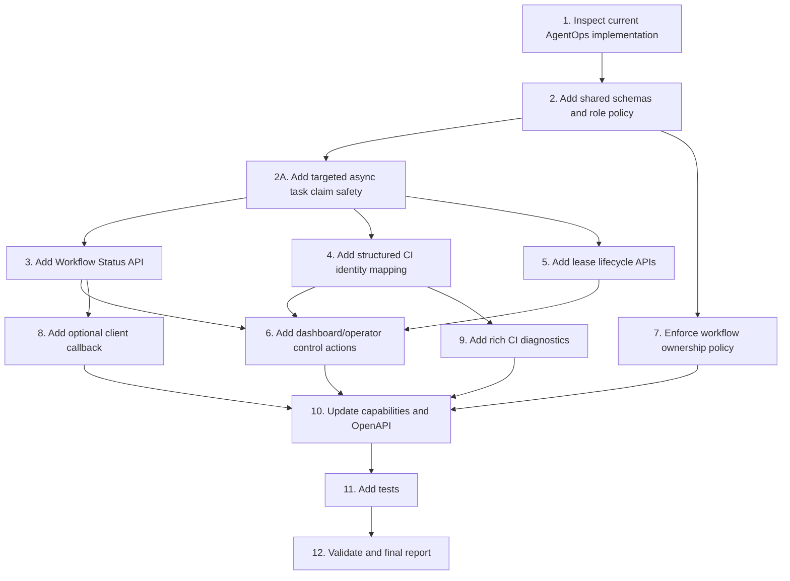

# Implementation Plan

## Overview

Implement DS AgentOps Phase 7 as a set of small, guarded control-plane increments. The work starts with targeted task claiming, compact read APIs, and deterministic CI mapping, then hardens lease lifecycle, operator recovery actions, role boundaries, optional callbacks, and CI diagnostics. Each task must preserve the current MVP flow and maintain Supabase/memory fallback behavior where practical.

## Task Dependency Graph



```json
{
  "waves": [
    {
      "id": "wave-1",
      "description": "Inspection and shared foundation",
      "tasks": ["1", "2", "2A"]
    },
    {
      "id": "wave-2",
      "description": "P0 control-plane hardening",
      "tasks": ["3", "4", "5"]
    },
    {
      "id": "wave-3",
      "description": "P1 operator controls and role boundaries",
      "tasks": ["6", "7"]
    },
    {
      "id": "wave-4",
      "description": "P2 callback and CI diagnostics",
      "tasks": ["8", "9"]
    },
    {
      "id": "wave-5",
      "description": "Documentation, tests, and validation",
      "tasks": ["10", "11", "12"]
    }
  ]
}
```

## Tasks

- [ ] 1. Inspect current AgentOps implementation
  - Read `src/server.ts`, `src/agentops/router.ts`, `src/asyncWorkflowStore.ts`, `src/asyncWorkflowSchemas.ts`, `src/state/stateEngine.ts`, scheduler files, dashboard files, and orchestration repository files.
  - Confirm current Supabase and memory-store behavior.
  - Confirm current task statuses, workflow statuses, retry policy behavior, and event model.
  - Identify existing OpenAPI/capabilities surfaces that need updates.
  - _Requirements: 1, 2, 3, 4, 5, 6, 7, 8, 9_

- [ ] 2. Add shared schemas and role policy
  - Add or extend Zod schemas for workflow status, targeted async task claims, CI identity, lease renew/release, operator actions, callback config, and diagnostics metadata.
  - Add `AgentOpsRole` and ownership policy helpers.
  - Add common idempotency input handling where current patterns support it.
  - Keep all schema validation close to route/service boundaries.
  - _Requirements: 2, 3, 4, 5, 6, 7, 8, 9_

- [ ] 2A. Add targeted async task claim safety
  - Extend `POST /api/async-tasks/claim` schema with optional `task_id`, `workflow_id`, `repo`, `repo_owner`, `repo_name`, `branch`, `repo_branch`, and `pr_number` filters.
  - Match claim filters against merged workflow context and task payload metadata.
  - Ensure targeted claims do not fall back to unrelated capability-only tasks when filters do not match.
  - Add the supplied claim filters to `task_claimed` audit events.
  - Treat `wrong_task_claimed`, `claim_filter_mismatch`, and `claim_target_mismatch` as non-retryable failures that move to `dead_letter` instead of retry/requeue loop.
  - Keep Supabase-backed and memory fallback claim behavior aligned where practical.
  - _Requirements: 3, 8, 9_

- [ ] 3. Add Workflow Status API
  - Implement `GET /api/workflows/{workflow_id}/status`.
  - Add compact status projection service.
  - Include current task, progress, `needs_attention`, and attention reasons.
  - Ensure the response does not include full task arrays, event arrays, or large payloads.
  - Add Supabase repository query or projection path and memory fallback path.
  - _Requirements: 1, 8_

- [ ] 4. Add structured CI identity mapping
  - Add `CiIdentity` normalization from PR/task artifacts and GitHub webhook payloads.
  - Store `ci_identity` for `wait_github_ci` tasks while keeping `wait_key` backward-compatible.
  - Implement matching precedence: `repo + workflow_run_id`, `repo + check_suite_id`, `repo + head_sha`, `repo + pr_number + head_sha`, then `repo + pr_number` fallback.
  - Reject ambiguous same-precedence matches without transitioning tasks.
  - Keep duplicate delivery handling idempotent.
  - _Requirements: 2, 8_

- [ ] 5. Add lease lifecycle APIs
  - Implement `POST /api/async-tasks/{task_id}/lease/renew`.
  - Implement `POST /api/async-tasks/{task_id}/lease/release`.
  - Implement `POST /api/scheduler/recover-expired-leases` or route it through the existing scheduler tick when equivalent.
  - Enforce owner-only lease renew/release.
  - Apply retry/dead-letter behavior for expired leases.
  - Write events for renew, release, recovery, requeue, and dead-letter transitions.
  - _Requirements: 3, 8_

- [ ] 6. Add dashboard/operator control actions
  - Implement workflow cancel, pause, and resume endpoints.
  - Implement task retry, requeue, cancel, and force-ci-refresh endpoints.
  - Enforce state constraints and role checks.
  - Add idempotency handling for repeated UI clicks where current storage supports it.
  - For force CI refresh, use stored CI identity and GitHub read-only APIs only.
  - Write audit events for every accepted or rejected operator action when actor context is available.
  - _Requirements: 4, 8_

- [ ] 7. Enforce workflow ownership policy
  - Ensure only `orchestrator`, `agent_producer`, `operator`, or `system` can create workflows.
  - Ensure only state engine/system path creates next tasks.
  - Restrict normal `agent_worker` role to heartbeat, claim, lease renew, lease release, and submit result.
  - Document local/dev fallback behavior when role metadata is missing.
  - Add role policy tests.
  - _Requirements: 5, 8_

- [ ] 8. Add optional client callback/webhook
  - Extend workflow creation input with optional `callback_url` and `callback_events`.
  - Validate callback URL and supported events.
  - Dispatch compact workflow status on subscribed `succeeded`, `failed`, or `needs_attention` events.
  - Record callback delivery result and bounded retry metadata.
  - Preserve polling as the default when callback is absent.
  - _Requirements: 6, 8_

- [ ] 9. Add rich CI diagnostics
  - Add diagnostics collection service for failed CI events.
  - Store run URL, failed jobs, failed steps, conclusion, duration, artifact metadata, and capped log excerpt when available.
  - Redact obvious secrets from log excerpts.
  - Include diagnostics in `fix_ci` task payload.
  - Ensure diagnostics fetch failure records a warning without blocking CI transition.
  - _Requirements: 7, 8_

- [ ] 10. Update capabilities and OpenAPI documentation
  - Update `/api/capabilities` route output with new AgentOps endpoints.
  - Update `openapi.yaml` or equivalent REST action documentation.
  - Update README only if setup, env, or public behavior changes.
  - Confirm no destructive GitHub operations are introduced.
  - _Requirements: 1, 3, 4, 6, 8_

- [ ] 11. Add tests
  - Add unit tests for compact status projection.
  - Add unit tests for targeted claim filtering and wrong-claim non-retry behavior.
  - Add unit tests for CI identity matching and ambiguity detection.
  - Add unit tests for lease lifecycle and expired lease recovery.
  - Add unit tests for role policy matrix.
  - Add integration-style tests for new router endpoints if current repo test conventions support them.
  - Add diagnostics redaction/size-cap tests.
  - _Requirements: 1, 2, 3, 4, 5, 6, 7, 8, 9_

- [ ] 12. Validate and final report
  - Run `npm run typecheck`.
  - Run `npm run build`.
  - Run relevant tests if test scripts are added.
  - Report changed files, behavior changed, validation result, risks, and blockers.
  - Ensure PR CI is green before merge.
  - _Requirements: 1, 2, 3, 4, 5, 6, 7, 8, 9_

## Notes

- Work only on `feature/mvp7` or another guarded non-main branch.
- Keep each implementation PR small if this spec is split into later sub-PRs.
- Do not touch unrelated DS MCP functionality.
- Do not expose merge/delete/force-push/secret-management endpoints.
- Keep route handlers thin; move domain logic into services with tests.
- Keep Supabase-configured behavior and local memory fallback behavior aligned where practical.
- Use `npm run typecheck` and `npm run build` as required validation.
- All important transitions must create event/audit trail records.
- Targeted claim filters are required for production agent runs; capability-only claim is allowed only for broad worker pools where wrong-claim risk is acceptable.
