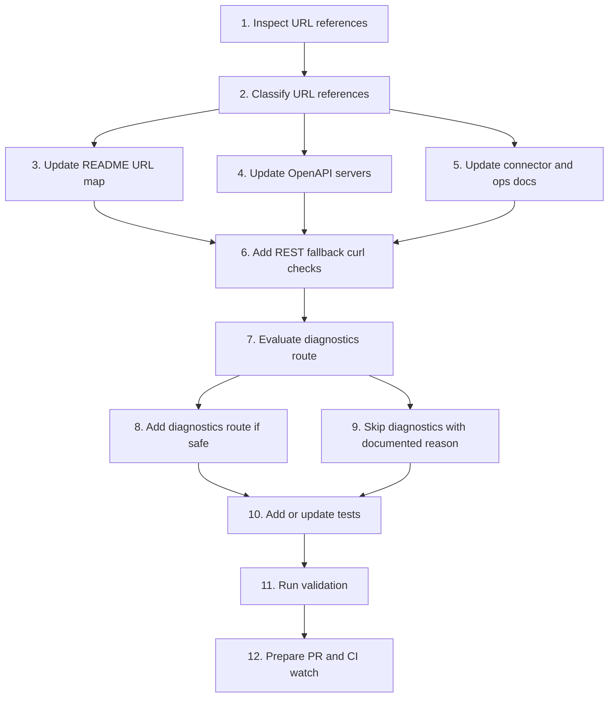

# Implementation Plan

## Overview

This plan creates an atomic implementation path for remapping the DS MCP Vercel URL from the stale `ds-mcp-server-theta.vercel.app` base to the current `ds-mcp-server-one.vercel.app` base. The work is documentation/config first, with an optional read-only diagnostic endpoint if the existing server structure supports it safely.

Target branch:

```txt
docs/remap-ds-mcp-vercel-url
```

Destination spec folder:

```txt
.kiro/specs/DS-OPS-09-vercel-url-remap-rest-mcp/
```

## Task Dependency Graph



```json
{
  "waves": [
    {
      "id": "wave-1",
      "description": "URL inventory",
      "tasks": ["1", "2"]
    },
    {
      "id": "wave-2",
      "description": "Documentation and OpenAPI remap",
      "tasks": ["3", "4", "5", "6"]
    },
    {
      "id": "wave-3",
      "description": "Diagnostics decision",
      "tasks": ["7", "8", "9"]
    },
    {
      "id": "wave-4",
      "description": "Tests and validation",
      "tasks": ["10", "11"]
    },
    {
      "id": "wave-5",
      "description": "PR and CI follow-up",
      "tasks": ["12"]
    }
  ]
}
```

## Tasks

- [x] 1. Inspect URL references
  - Checkout a guarded branch from `main`.
  - Search the repo for `ds-mcp-server-theta.vercel.app`.
  - Search the repo for `ds-mcp-server-one.vercel.app`.
  - Search the repo for generic `vercel.app` DS MCP references.
  - Capture every affected path and line.
  - _Requirements: 1, 3, 5_

- [x] 2. Classify URL references
  - Mark each stale URL occurrence as production, historical, preview, test, or unknown.
  - Treat README, OpenAPI, connector setup, webhook setup, and curl examples as production unless clearly labeled otherwise.
  - Identify any historical entries that should be preserved but relabeled.
  - Confirm no unrelated Rental Home URL is included in scope.
  - _Requirements: 1, 3_

- [x] 3. Update README URL map
  - Replace current-production stale DS MCP base URL with `https://ds-mcp-server-one.vercel.app`.
  - Add or update a concise URL map covering `/health`, `/mcp`, REST GitHub routes, and webhook route.
  - Add a short note that old `theta` URL is stale if historical context is needed.
  - Keep existing REST path descriptions intact.
  - _Requirements: 1, 2_

- [x] 4. Update OpenAPI servers
  - Open `openapi.yaml`.
  - Replace stale server URL with `https://ds-mcp-server-one.vercel.app`.
  - Ensure YAML remains valid.
  - If multiple servers exist, mark production clearly.
  - Do not change endpoint schemas unless they are obviously stale due to URL-only drift.
  - _Requirements: 1, 3, 5_

- [x] 5. Update connector and operations docs
  - Update `docs/workspace-agent-trigger-setup.md` if it contains stale MCP or REST URL.
  - Update `docs/agentops-admin-ui.md` if it contains stale dashboard/API URL.
  - Update `docs/tasks-xstate-supabase.md` if it contains stale AgentOps/API URL.
  - Update `docs/mcp-phase-2-hardening.md` if it contains stale MCP URL.
  - Update `.env.example` only if it contains URL examples, not secrets.
  - _Requirements: 1, 2, 3_

- [x] 6. Add REST fallback curl checks
  - Add curl examples for `/health`.
  - Add bearer-token curl example for repo metadata.
  - Add guarded-branch examples for branch creation and file upsert only if docs already include write examples.
  - Ensure examples use `$REST_API_BEARER_TOKEN` placeholder only.
  - Ensure examples do not write to `main`.
  - _Requirements: 2, 5_

- [x] 7. Evaluate diagnostics route
  - Inspect `src/server.ts` and routing conventions.
  - Check whether `/health` already returns environment or service metadata.
  - Decide whether adding `/api/diagnostics/url-map` is low-risk.
  - If route addition would touch too much runtime code, skip it and document manual curl checks instead.
  - _Requirements: 4, 5_

- [x] 8. Add diagnostics route if safe
  - Add a read-only diagnostics route using the smallest existing routing surface.
  - Return service name, environment, canonical base URL, and route paths.
  - Do not return secrets, tokens, env values, or GitHub credentials.
  - Add tests if current test harness supports route-level tests.
  - _Requirements: 4, 5_

- [-] 9. Skip diagnostics with documented reason
  - Use this task only if Task 8 is not safe.
  - Add a note to README or ops docs explaining manual URL verification.
  - Include exact curl commands for `/health`, `/mcp`, and bearer-protected REST repo metadata.
  - _Requirements: 4, 5_

- [x] 10. Add or update tests
  - Add a lightweight test for diagnostics route if implemented.
  - Add or update snapshot/string tests only if current repo already has matching test conventions.
  - Do not add brittle tests for every Markdown line.
  - If no tests are appropriate, document why validation is documentation-only.
  - _Requirements: 4, 5_

- [x] 11. Run validation
  - Run `npm run typecheck`.
  - Run `npm run build`.
  - Run `npm test`.
  - Run grep checks for stale and current DS MCP URLs.
  - Record any failures honestly with logs or command output.
  - _Requirements: 1, 2, 3, 4, 5_

- [x] 12. Prepare PR and CI watch
  - Commit changes to `docs/remap-ds-mcp-vercel-url`.
  - Open PR to `main`.
  - Include changed files, URL mapping, validation result, and any skipped diagnostics explanation.
  - Schedule CI follow-up after 2 minutes per project rule.
  - If CI fails, fix, push, and continue the 2-minute CI watch loop until green.
  - _Requirements: 5_

## Notes

- Canonical DS MCP URL for this task is `https://ds-mcp-server-one.vercel.app`.
- Old URL `https://ds-mcp-server-theta.vercel.app` must not remain as current production guidance.
- Keep all changes scoped to DS MCP URL mapping and diagnostics.
- Do not expose secrets.
- Do not write directly to `main`.
- Use guarded branch prefix `docs/`.
- If connector write access is blocked, export patch or ZIP and report the blocker.
- CI failure after conflict resolution: `src/server.ts(1662,87): TS2304 Cannot find name 'isRestAuthorized'`.
- Root cause: obsolete REST auth block survived while the repository had migrated to centralized `enforceSecurity` and `resolveRoutePolicy`.
- Fix: removed the obsolete check, registered `/api/diagnostics/url-map` as an explicit public route, and added route-policy regression coverage.
- GitHub Actions CI run `29095522259` passed for fix head `8f0f79a1f90bd8b9602ab710b77363d91dc06d19`.
