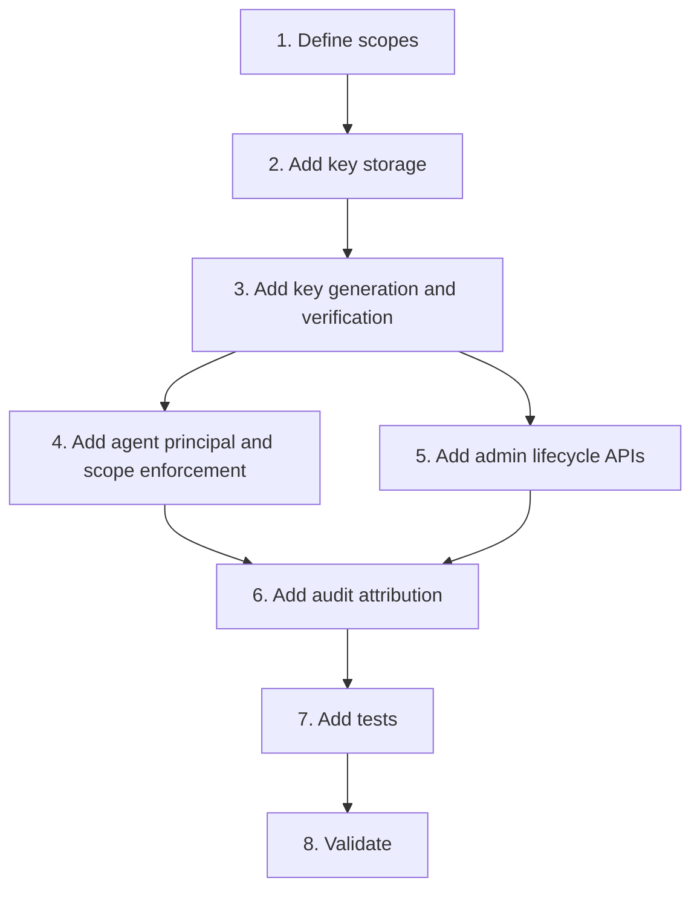

# Implementation Plan

## Overview

Introduce machine identity after human RBAC foundations are available.

## Task Dependency Graph

## Tasks

- [ ] 1. Define scopes
  - Declare task, workflow, GitHub, dashboard, and security scopes.
  - Map machine routes to scopes.
  - _Requirements: 2_

- [ ] 2. Add key storage
  - Add migration for hashed key metadata.
  - Add indexes for prefix and active status.
  - _Requirements: 1, 3_

- [ ] 3. Add key generation and verification
  - Generate one-time plaintext secrets.
  - Store secure hashes only.
  - _Requirements: 1_

- [ ] 4. Add agent principal and scope enforcement
  - Authenticate agent keys and enforce required route scopes.
  - _Requirements: 1, 2, 3_

- [ ] 5. Add admin lifecycle APIs
  - Add create, list metadata, revoke, and rotate operations.
  - Protect with `security:admin`.
  - _Requirements: 3, 4_

- [ ] 6. Add audit attribution
  - Record agent and key identifiers without secret material.
  - _Requirements: 5_

- [ ] 7. Add tests
  - Cover invalid, expired, revoked, wrong-scope, and rotated keys.
  - _Requirements: 1, 2, 3, 4, 5_

- [ ] 8. Validate
  - Run migrations, typecheck, build, and tests.
  - _Requirements: 5_

## Notes

- Depends on `SEC-WEB-02-admin-auth-rbac` for secure administration.
- Initial rollout may retain the shared REST bearer only as a time-bounded compatibility path.
