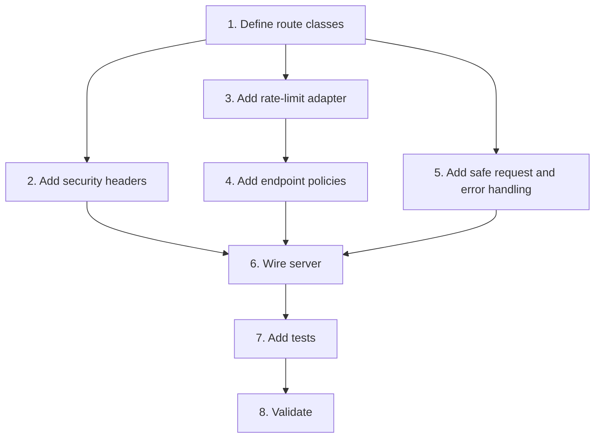

# Implementation Plan

## Overview

Harden HTTP behavior after identity and authorization are established.

## Task Dependency Graph

## Tasks

- [ ] 1. Define route classes
  - Classify login, read, task write, GitHub write, upload, and security admin traffic.
  - _Requirements: 2, 3_

- [ ] 2. Add security headers
  - Add CSP, HSTS, referrer, frame, MIME, and permissions controls.
  - _Requirements: 1_

- [ ] 3. Add rate-limit adapter
  - Implement shared-store production adapter and local test adapter.
  - _Requirements: 2_

- [ ] 4. Add endpoint policies
  - Configure stricter write, upload, login, and key-admin limits.
  - _Requirements: 3_

- [ ] 5. Add safe request and error handling
  - Validate content types and ambiguous credential headers.
  - Standardize safe error codes and request IDs.
  - _Requirements: 4_

- [ ] 6. Wire server
  - Apply controls before route handlers.
  - _Requirements: 1, 2, 3, 4_

- [ ] 7. Add tests
  - Cover headers, distributed limits, rejected downstream calls, and safe errors.
  - _Requirements: 5_

- [ ] 8. Validate
  - Run production-like configuration, typecheck, build, and tests.
  - _Requirements: 5_

## Notes

- Depends on route identity from `SEC-MCP-01`, `SEC-WEB-02`, and `SEC-AGENT-01`.
