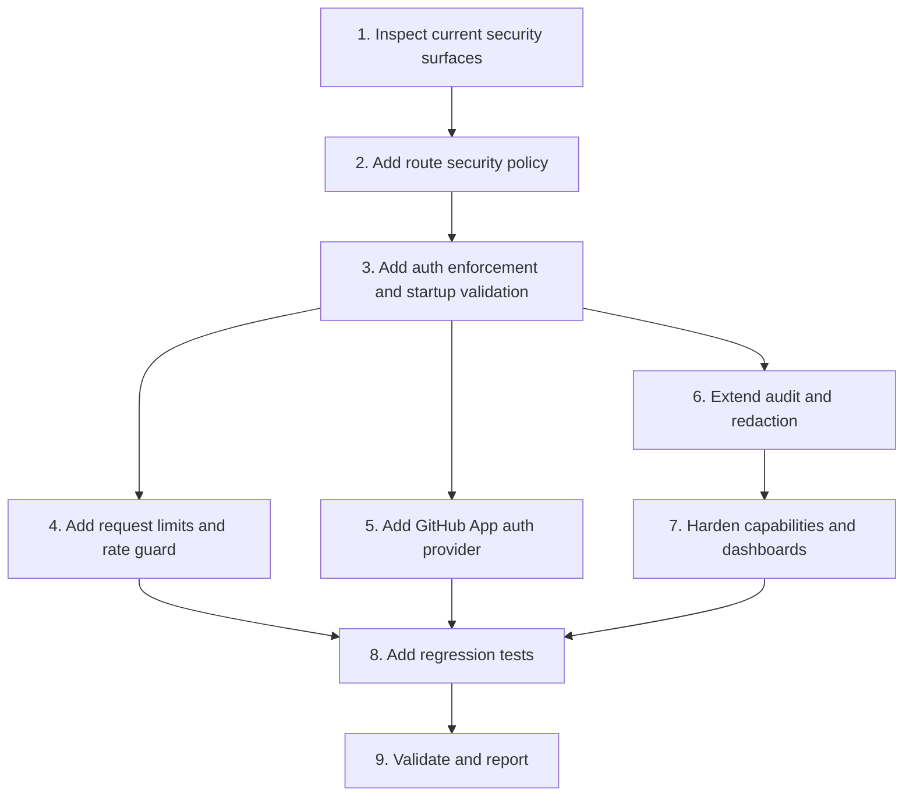

# Implementation Plan

## Overview

Implement Phase 3 MCP security hardening in small, testable slices. Start with explicit route policy and auth enforcement, then add strict startup validation, request limits, GitHub App token preference, durable audit extension, dashboard/capability redaction, and regression tests.

## Task Dependency Graph



```json
{
  "waves": [
    {
      "id": "wave-1",
      "description": "Inspection and explicit security policy",
      "tasks": ["1", "2"]
    },
    {
      "id": "wave-2",
      "description": "Auth enforcement and strict startup validation",
      "tasks": ["3"]
    },
    {
      "id": "wave-3",
      "description": "Request hardening and GitHub credential hardening",
      "tasks": ["4", "5"]
    },
    {
      "id": "wave-4",
      "description": "Audit, redaction, dashboard, and capability hardening",
      "tasks": ["6", "7"]
    },
    {
      "id": "wave-5",
      "description": "Tests, validation, and final report",
      "tasks": ["8", "9"]
    }
  ]
}
```

## Tasks

- [ ] 1. Inspect current security surfaces
  - Read `README.md`, `docs/mcp-phase-2-hardening.md`, `.env.example`, `src/server.ts`, `src/config.ts`, `src/mcp.ts`, `src/tools/githubClient.ts`, and AgentOps routers.
  - List all public, REST, MCP, internal, dashboard, and GitHub routes.
  - Identify existing auth checks and gaps.
  - Confirm current behavior for `MCP_BEARER_TOKEN`, `REST_API_BEARER_TOKEN`, and `WORKSPACE_AGENT_CALLBACK_TOKEN`.
  - _Requirements: 1, 2, 3, 4, 6_

- [ ] 2. Add route security policy
  - Create `src/security/routePolicy.ts`.
  - Classify known routes as `public`, `bearer_required`, `internal_token_required`, or `disabled`.
  - Ensure unknown sensitive `/api/*` routes fail closed.
  - Add unit tests for known route classifications.
  - _Requirements: 1, 6_

- [ ] 3. Add auth enforcement and startup validation
  - Create `src/security/auth.ts`.
  - Create `src/security/startupValidation.ts`.
  - Wire policy and auth enforcement into `src/server.ts` before route handlers execute.
  - Add strict mode config using `SECURITY_ENFORCEMENT` and `NODE_ENV`.
  - Refuse startup in strict mode when required tokens are missing.
  - Ensure internal callback routes require only `WORKSPACE_AGENT_CALLBACK_TOKEN`.
  - _Requirements: 1, 2_

- [ ] 4. Add request limits and rate guard
  - Create `src/security/requestLimits.ts`.
  - Replace raw JSON body reading with size-bounded reading.
  - Add `MAX_JSON_BODY_BYTES` config with safe default.
  - Add lightweight in-memory rate limiting for sensitive routes.
  - Add `CORS_ALLOWED_ORIGINS` support for strict mode.
  - _Requirements: 5_

- [ ] 5. Add GitHub App auth provider
  - Create `src/tools/githubAuth.ts`.
  - Add config for `GITHUB_APP_ID`, `GITHUB_APP_PRIVATE_KEY`, and `GITHUB_APP_INSTALLATION_ID`.
  - Prefer GitHub App installation tokens when configured.
  - Preserve PAT fallback for local/MVP mode.
  - Report `github_auth_mode` in capabilities without exposing credentials.
  - _Requirements: 3_

- [ ] 6. Extend audit and redaction
  - Create `src/security/redaction.ts`.
  - Create or extend `src/tools/auditSink.ts`.
  - Redact authorization headers, cookies, token-like fields, service role keys, private keys, and backend secrets.
  - Emit audit events for auth failures, write failures, write successes, and sensitive GitHub reads.
  - Add optional persistent audit sink config without breaking stdout audit.
  - _Requirements: 4, 6_

- [ ] 7. Harden capabilities and dashboards
  - Review `/api/capabilities`, `/dashboard/upstream-calls`, and `/api/dashboard/upstream-calls`.
  - Ensure outputs contain only safe booleans and non-sensitive route/tool names.
  - Add `DASHBOARD_AUTH_REQUIRED` support.
  - Keep HTML escaping for rendered dashboard values.
  - Remove or redact query strings and secret-like dashboard fields.
  - _Requirements: 6_

- [ ] 8. Add regression tests
  - Add tests for route policy and fail-closed behavior.
  - Add tests for bearer auth success/failure.
  - Add tests for strict startup validation.
  - Add tests for GitHub protected branch and allowed repo guardrails.
  - Add tests for redaction.
  - Add tests for capability/dashboard no-secret output.
  - _Requirements: 1, 2, 3, 4, 5, 6, 7_

- [ ] 9. Validate and report
  - Run `npm run typecheck`.
  - Run `npm run build`.
  - Run relevant tests.
  - Report changed files.
  - Report security behavior changed.
  - Report validation result honestly.
  - Report remaining risks and production toggles.
  - _Requirements: 7_

## Notes

- Do not combine this with unrelated UI/AgentOps work.
- Do not expose destructive GitHub tools.
- Do not commit real secrets or sample real tokens.
- Keep local development possible through relaxed mode.
- Production/strict mode must fail closed.
- Preserve existing public `/health` behavior, but keep it non-sensitive.
- Prefer GitHub App auth over PAT for production.
- If this spec is implemented and pushed as a PR, schedule CI monitoring after PR creation and repeat fix/check until green.
