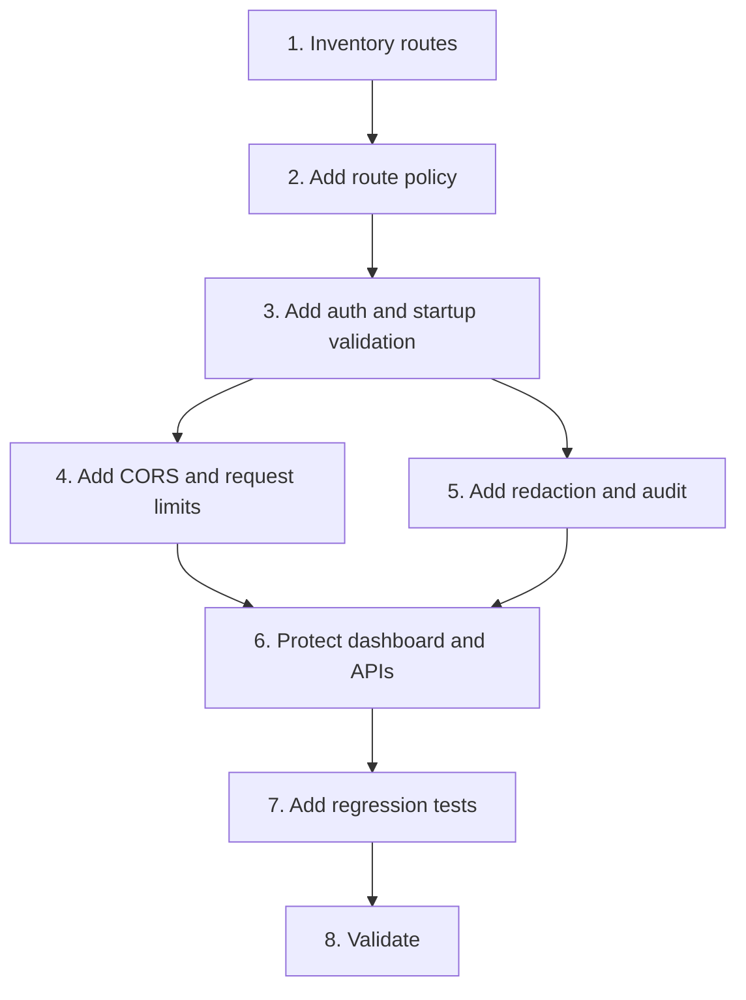

# Implementation Plan

## Overview

Implement the production perimeter before adding user login or agent key management.

## Task Dependency Graph

## Tasks

- [x] 1. Inventory routes
  - Enumerate public, MCP, REST, dashboard, internal callback, and webhook routes.
  - Record the required security policy for each route.
  - _Requirements: 1_

- [x] 2. Add route policy
  - Implement a centralized route classifier.
  - Deny unmatched sensitive routes.
  - _Requirements: 1_

- [x] 3. Add auth and startup validation
  - Centralize shared-secret validation.
  - Add strict production startup checks.
  - Keep internal callback and webhook credentials isolated.
  - _Requirements: 1, 2_

- [x] 4. Add CORS and request limits
  - Replace wildcard production CORS.
  - Add bounded body reading and rate controls.
  - _Requirements: 3_

- [x] 5. Add redaction and audit
  - Redact secrets in logs, dashboards, errors, and audit payloads.
  - Emit security denial and write outcome events.
  - _Requirements: 4_

- [x] 6. Protect dashboard and APIs
  - Require authentication for admin HTML, dashboard JSON, AgentOps, and GitHub gateway routes.
  - Preserve public health and signed webhook behavior.
  - _Requirements: 1, 2, 3, 4_

- [x] 7. Add regression tests
  - Cover `401`, `403`, `413`, `429`, unknown routes, and no-secret output.
  - _Requirements: 5_

- [x] 8. Validate
  - Run typecheck, build, and tests.
  - Report configuration changes and remaining risks.
  - _Requirements: 5_

## Notes

- This is the P0 dependency for all other security specs.
- Do not store bearer tokens in browser code.
- Keep local relaxed mode explicit and visibly marked.
