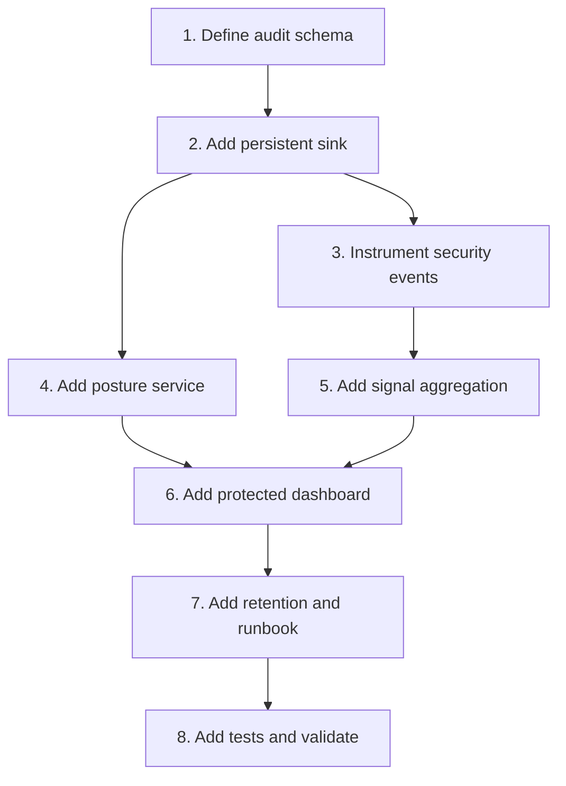

# Implementation Plan

## Overview

Add durable visibility after authentication, authorization, and HTTP hardening are in place.

## Task Dependency Graph

## Tasks

- [ ] 1. Define audit schema
  - Define event, actor, resource, reason, and redacted metadata fields.
  - _Requirements: 1, 4_

- [ ] 2. Add persistent sink
  - Add durable storage and retention configuration.
  - _Requirements: 1, 4_

- [ ] 3. Instrument security events
  - Cover auth failures, denials, writes, key lifecycle, audit access, and webhook failures.
  - _Requirements: 1, 4_

- [ ] 4. Add posture service
  - Report security control status without values.
  - _Requirements: 2_

- [ ] 5. Add signal aggregation
  - Aggregate repeated failures, revoked-key usage, invalid signatures, and suspicious GitHub writes.
  - _Requirements: 3_

- [ ] 6. Add protected dashboard
  - Require `security:admin`.
  - Link signals to redacted audit evidence.
  - _Requirements: 2, 3, 4_

- [ ] 7. Add retention and runbook
  - Add purge behavior and incident response documentation.
  - _Requirements: 4, 5_

- [ ] 8. Add tests and validate
  - Test persistence, redaction, posture, signals, retention, and access.
  - Run typecheck, build, and tests.
  - _Requirements: 5_

## Notes

- Depends on all earlier security specs.
- Audit access must generate an audit event.
