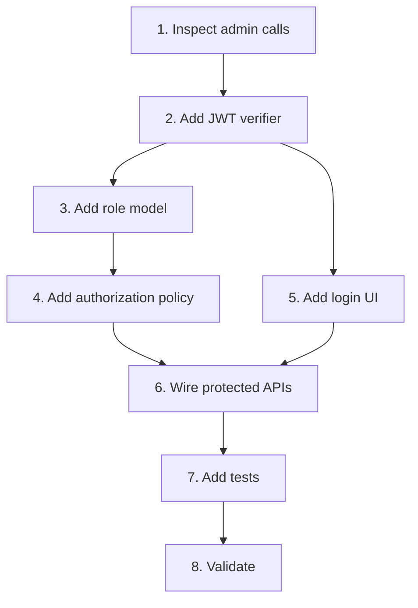

# Implementation Plan

## Overview

Add human authentication after the P0 perimeter is enforced.

## Task Dependency Graph

## Tasks

- [ ] 1. Inspect admin calls
  - Map every admin UI API call to a permission.
  - _Requirements: 1, 3_

- [ ] 2. Add JWT verifier
  - Verify Supabase issuer, audience, signature, and expiry.
  - Create a server-derived user principal.
  - _Requirements: 2_

- [ ] 3. Add role model
  - Add active user-to-role mapping and lookup.
  - Deny missing or disabled mappings.
  - _Requirements: 3_

- [ ] 4. Add authorization policy
  - Define admin, operator, and viewer permissions.
  - Enforce policy before handlers.
  - _Requirements: 3_

- [ ] 5. Add login UI
  - Add login, logout, session refresh, and auth error UX.
  - Remove any manual shared-token input from the normal flow.
  - _Requirements: 1, 4, 5_

- [ ] 6. Wire protected APIs
  - Attach user JWTs and handle `401`/`403`.
  - _Requirements: 1, 2, 3, 5_

- [ ] 7. Add tests
  - Cover role matrices, forged claims, disabled users, and expired sessions.
  - _Requirements: 2, 3, 5_

- [ ] 8. Validate
  - Run typecheck, build, and tests.
  - _Requirements: 5_

## Notes

- Depends on `SEC-MCP-01-security-hardening`.
- Never expose the Supabase service-role key.
