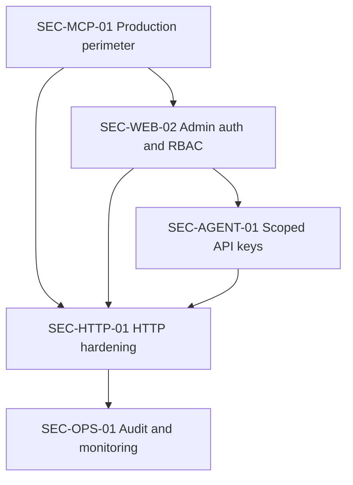

# DS MCP Security Roadmap

## Delivery order

1. `SEC-MCP-01-security-hardening` — P0 production perimeter and fail-closed controls.
2. `SEC-WEB-02-admin-auth-rbac` — human login and RBAC.
3. `SEC-AGENT-01-scoped-api-keys` — unique machine identity and scoped keys.
4. `SEC-HTTP-01-browser-api-hardening` — browser headers, distributed rate limits, and safe request handling.
5. `SEC-OPS-01-security-audit-monitoring` — durable audit, security posture, signals, retention, and runbook.

## Dependency graph

## Release gates

### Gate 1 — Internet-safe baseline

- Sensitive routes fail closed.
- Admin/dashboard/API surfaces require authentication.
- Production refuses missing security configuration.
- CORS is allowlisted.
- Secrets are redacted.

### Gate 2 — Human access

- Supabase JWT verification is server-side.
- Admin, operator, and viewer permissions are tested.
- Shared REST token is removed from normal browser usage.

### Gate 3 — Machine identity

- Each agent has a unique hashed API key.
- Scopes, expiry, revocation, rotation, and attribution are active.

### Gate 4 — Abuse resistance

- Distributed rate limits are active in production.
- CSP and security headers are deployed.
- Payload and media-type boundaries are enforced.

### Gate 5 — Operational readiness

- Audit events are durable.
- Security posture and signals are admin-only.
- Retention and incident runbook are tested.
